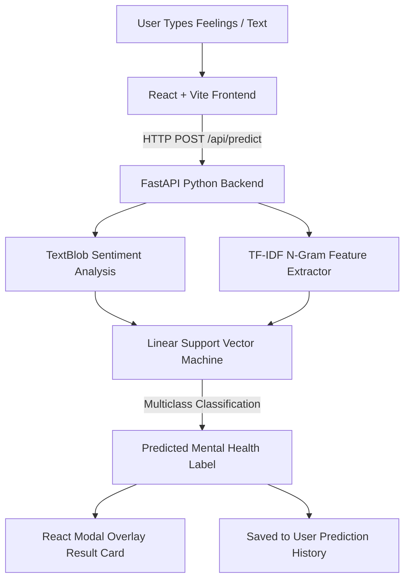

# 🧠 Mental Health Prediction System (SVM)

> A modern, AI-powered web application that analyzes user text feelings and predicts mental health states using Support Vector Machine (SVM) classification, NLP sentiment analysis, and a stunning React frontend.

---


---

## 🌟 Key Features

- 🧠 **5 Distinct Mental Health Classes**:
  - **Normal / Healthy**: Stable emotional baseline & healthy routine indicators.
  - **Depression**: Persistent low mood, fatigue, and interest loss indicators.
  - **Anxiety**: Tension, nervousness, panic, or stress signals.
  - **Bipolar Spectrum**: Mood fluctuation and energy swing indicators.
  - **Suicidal Ideation / Distress**: High distress signals with immediate emergency helpline resources.

- 🎨 **Stunning & Responsive UI/UX**:
  - **Soft Pastel Azure Theme**: Calm, peaceful, airy light blue aesthetic designed for mental wellness.
  - **Dark & Light Mode Support**: Seamless toggle saved to local preferences.
  - **Glassmorphism & Micro-animations**: Smooth Framer Motion transitions and reactive feedback.

- 👤 **Custom Human Emotion Icons**: Hand-crafted SVG human silhouettes reflecting each specific emotional state.
- 🪟 **Modal Popup Results**: Prediction results appear in a floating backdrop-blur modal container.
- 📜 **Personal Prediction History**: Track past emotion assessments with search filtering, category pills, and full text logs.
- 🔐 **User Authentication & Live Validation**:
  - Sign Up with live password strength validation (**8+ characters**, **1 uppercase letter**, **1 special symbol**).
  - Light mode & Dark mode compatible form controls.

---

## 📐 System Architecture



---

## 📁 Project Structure

```
Mental-Health-Prediction-System/
├── 📁 backend/                        # FastAPI Machine Learning Server
│   ├── main.py                        # REST API Endpoints & CORS Middleware
│   ├── predictor.py                   # SVM Classifier & TF-IDF Prediction Pipeline
│   ├── requirements.txt               # Python Dependencies
│   └── 📁 model/                      # Saved Model Artifacts (.pkl)
│
└── 📁 frontend/                       # React 18 Web Application
    ├── 📁 src/
    │   ├── 📁 components/             # Reusable UI Components
    │   │   ├── Navbar.jsx             # Top Navigation with Theme & Auth
    │   │   ├── Footer.jsx             # Footer with Emergency Helpline
    │   │   ├── PredictionCard.jsx     # Result Popup Overlay Modal
    │   │   ├── ClassPreviewCards.jsx  # System Capabilities Cards
    │   │   └── HumanClassIcons.jsx    # Custom Human Silhouette SVG Icons
    │   ├── 📁 context/                # Global React Contexts
    │   │   ├── AuthContext.jsx        # Login, Signup, Session State
    │   │   └── ThemeContext.jsx       # Dark / Light Mode Provider
    │   ├── 📁 pages/                  # Main Application Views
    │   │   ├── Home.jsx               # Feelings Input & Dashboard
    │   │   ├── History.jsx            # Prediction Log & Search
    │   │   ├── Login.jsx              # User Login Page
    │   │   └── Signup.jsx             # Registration with Live Validation
    │   └── 📁 services/               # API Communication Bridge
    │       └── mockApi.js             # API Service & Storage Layer
    ├── index.html
    ├── package.json
    └── tailwind.config.js             # Tailwind v3 Configuration
```

---

## 🚀 Quick Start Guide

### Prerequisites
- **Node.js** (v18 or higher)
- **Python** (v3.9 or higher)
- **npm** or **yarn**

---

### 1️⃣ Backend Setup (FastAPI + Machine Learning)

1. Navigate to the backend directory:
   ```bash
   cd backend
   ```

2. Create and activate a virtual environment (optional but recommended):
   ```bash
   # Windows
   python -m venv venv
   .\venv\Scripts\activate

   # macOS / Linux
   python3 -m venv venv
   source venv/bin/activate
   ```

3. Install required Python packages:
   ```bash
   pip install -r requirements.txt
   ```

4. Start the FastAPI backend server:
   ```bash
   uvicorn main:app --reload --port 8000
   ```
   *The server will start running at `http://localhost:8000`.*  
   *Interactive API Documentation available at `http://localhost:8000/docs`.*

---

### 2️⃣ Frontend Setup (React + Vite + Tailwind CSS)

1. Open a new terminal and navigate to the frontend directory:
   ```bash
   cd frontend
   ```

2. Install dependencies:
   ```bash
   npm install
   ```

3. Start the Vite development server:
   ```bash
   npm run dev
   ```
   *Open your browser at `http://localhost:5173`.*

---

## ⚙️ Machine Learning Model Details

| Parameter | Specification |
| :--- | :--- |
| **Model Algorithm** | Support Vector Machine (`LinearSVC` / `SVC`) |
| **Vectorization** | TF-IDF (Term Frequency-Inverse Document Frequency) |
| **Sentiment Extraction** | TextBlob Polarity & Subjectivity Scores |
| **Target Classes (5)** | `Normal`, `Depression`, `Anxiety`, `Bipolar`, `Suicidal` |
| **Multiclass Strategy** | One-vs-Rest (OvR) Decision Boundaries |

---

## 🔒 Password Security Requirements

During account creation, passwords are validated against strict criteria:
- 📌 **At least 8 characters** long
- 🔠 **At least 1 uppercase letter** (`A-Z`)
- 🔣 **At least 1 special symbol** (e.g., `!@#$%^&*`)

---

## 🛠️ Tech Stack & Libraries

### **Frontend**
- **Core**: React 18, JavaScript (ES6+), HTML5
- **Styling**: Tailwind CSS v3, Glassmorphism, Vanilla CSS
- **Animations**: Framer Motion
- **Icons**: Lucide React & Custom SVG Human Emotion Icons
- **Routing**: React Router Dom v6

### **Backend**
- **Framework**: FastAPI, Uvicorn
- **Machine Learning**: Scikit-Learn, Joblib, NumPy, Pandas
- **Natural Language Processing**: TextBlob, NLTK
- **Validation**: Pydantic v2

---

## 🤝 License & Credits

This project was developed as a **Final Year Computer Science / Software Engineering Capstone Project** focusing on mental health early screening using Machine Learning and NLP.

*Made with care for mental health awareness & technical excellence.* 💙
